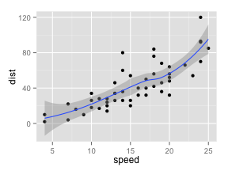
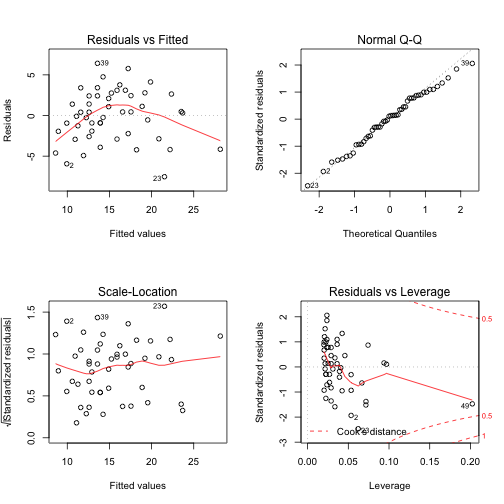

Using R Markdown with RStudio
========================================================

This is an R Markdown document. Markdown is a simple formatting syntax for authoring web pages (click the **MD** toolbar button for help on Markdown).

When you click the **Knit HTML** button a web page will be generated that includes both content as well as the output of any embedded R code chunks within the document. You can embed an R code chunk like this:


```r
summary(cars)
```

```
##      speed           dist    
##  Min.   : 4.0   Min.   :  2  
##  1st Qu.:12.0   1st Qu.: 26  
##  Median :15.0   Median : 36  
##  Mean   :15.4   Mean   : 43  
##  3rd Qu.:19.0   3rd Qu.: 56  
##  Max.   :25.0   Max.   :120
```


You can also embed plots, for example:


```r
plot(cars)
```

 


Markdown Basics (taken from RStudio site)
-------------------

Use an asterisk mark to provide emphasis such as *italics* and **bold**.

Create lists with a dash:
- Item 1
- Item 2
- Item 3

You can write `in-line` code with a back-tick.

```
Code blocks display 
with fixed-width font
```

> Blockquotes are offset

Note that the toolbar provides some usefile tools for working with R Markdown:

* **Quick Reference** - Click the **MD** toolbar button to open a quick reference quide for Markdown.
* **Knit HTML** - Click to knit the current document to HTML, see the **Knitting to HTML** section below for more details.
* **Run** - Run the current line or selection of lines in the console. This allows running R code inside a code chunk similar to a normal R sourch file.
* **Chunks** - The chunks menu provides assistance with inserting, running, and chunk navigation.

Embedding R Code Chunks
-------------------------

Within an R Markdown file, R code chunks can be embedded using the native Markdown syntax for code regions


```r
# R code goes here
```


For example, the following code chunk computes a data summary and renders a plot as a PNG image. It then embeds the results within a standalone HTML file:


```r
# quick summary and plot
require(ggplot2)
summary(cars)
```

```
##      speed           dist    
##  Min.   : 4.0   Min.   :  2  
##  1st Qu.:12.0   1st Qu.: 26  
##  Median :15.0   Median : 36  
##  Mean   :15.4   Mean   : 43  
##  3rd Qu.:19.0   3rd Qu.: 56  
##  Max.   :25.0   Max.   :120
```

```r
qplot(speed, dist, data = cars) + geom_smooth()
```

 


Creating APA-style tables using stargazer
--------------------------

You can also create APA-style tables using the stargazer package in R


```r
# install.packages('stargazer')

require(stargazer)

myModel <- lm(speed ~ dist, data = cars)
summary(myModel)
```

```
## 
## Call:
## lm(formula = speed ~ dist, data = cars)
## 
## Residuals:
##    Min     1Q Median     3Q    Max 
## -7.529 -2.155  0.362  2.438  6.418 
## 
## Coefficients:
##             Estimate Std. Error t value Pr(>|t|)    
## (Intercept)   8.2839     0.8744    9.47  1.4e-12 ***
## dist          0.1656     0.0175    9.46  1.5e-12 ***
## ---
## Signif. codes:  0 '***' 0.001 '**' 0.01 '*' 0.05 '.' 0.1 ' ' 1
## 
## Residual standard error: 3.16 on 48 degrees of freedom
## Multiple R-squared:  0.651,	Adjusted R-squared:  0.644 
## F-statistic: 89.6 on 1 and 48 DF,  p-value: 1.49e-12
```

```r

par(mfrow = c(2, 2))
plot(myModel)
```

 


```r

stargazer(myModel, title = "Regression Results", type = "html")
```


<table style="text-align:center"><caption><strong>Regression Results</strong></caption>
<tr><td colspan="2" style="border-bottom: 1px solid black"></td></tr><tr><td style="text-align:left"></td><td><em>Dependent variable:</em></td></tr>
<tr><td></td><td colspan="1" style="border-bottom: 1px solid black"></td></tr>
<tr><td style="text-align:left"></td><td>speed</td></tr>
<tr><td colspan="2" style="border-bottom: 1px solid black"></td></tr><tr><td style="text-align:left">dist</td><td>0.166<sup>***</sup></td></tr>
<tr><td style="text-align:left"></td><td>(0.017)</td></tr>
<tr><td style="text-align:left"></td><td></td></tr>
<tr><td style="text-align:left">Constant</td><td>8.284<sup>***</sup></td></tr>
<tr><td style="text-align:left"></td><td>(0.874)</td></tr>
<tr><td style="text-align:left"></td><td></td></tr>
<tr><td colspan="2" style="border-bottom: 1px solid black"></td></tr><tr><td style="text-align:left">Observations</td><td>50</td></tr>
<tr><td style="text-align:left">R<sup>2</sup></td><td>0.651</td></tr>
<tr><td style="text-align:left">Adjusted R<sup>2</sup></td><td>0.644</td></tr>
<tr><td style="text-align:left">Residual Std. Error</td><td>3.156 (df = 48)</td></tr>
<tr><td style="text-align:left">F Statistic</td><td>89.570<sup>***</sup> (df = 1; 48)</td></tr>
<tr><td colspan="2" style="border-bottom: 1px solid black"></td></tr><tr><td style="text-align:left"><em>Note:</em></td><td style="text-align:right"><sup>*</sup>p<0.1; <sup>**</sup>p<0.05; <sup>***</sup>p<0.01</td></tr>
</table>


Embedding Inline R Code
--------------------------

You can also evaluate R expressions inline by enclosing the expression within a single back-tick qualified with 'r'. For example, the following code:


```r
# I counted `r 1 + 1` red trucks on the highway.
```


Results in this output: I counted 2 red trucks on the highway.

Navigating Between Chunks
--------------------------

A popup navigation menu is located at the bottom of the editor based on the chunk labels (optional) in your Rmd file. This makes editing and navigating between chunks easy.

Using the Chunk Menu
---------------------

The Chunk Menu makes it easy to insert new chunks and execute R code from within an R Markdown document.

* **Insert Chunk** - Inserts the basic syntax for an embedded R code chunk
* **Jump To...** - Opens the Chunk Navigation Menu to jump to a specific code chunk.
* **Run Current/Next Chunk** - Runs the current (or next) code chunk based on the cursor position. You can use this to iteratively step through code chunks one-by-one to test your R code. This interacts with the console and acts upon the current global environment.
* **Run All** - Run all R code chunks in the current document.


